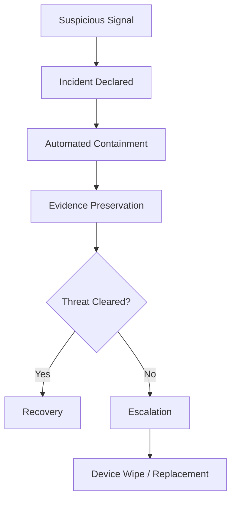

# Incident Response Integration  
**Endpoint Signals, Containment Actions, and Coordinated Recovery**

---

## Purpose

This document defines the **authoritative integration model** between Microsoft Intune–managed Windows 11 endpoints and the organization’s **incident response (IR)** process.

The objective is to ensure that:
- Endpoint signals trigger timely incident response
- Containment actions are decisive and repeatable
- Evidence is preserved for investigation and audit
- Recovery actions restore trust without improvisation

Incident response is **not optional** and **not ad-hoc**.

---

## Scope

This document covers:
- Detection sources
- Incident classification
- Automated and manual containment
- Evidence preservation
- Recovery and closure
- Post-incident review

It applies to **all managed Windows 11 devices**.

---

## Design Principles

1. **Assume compromise until proven otherwise**
2. **Contain first, analyze second**
3. **Automate wherever safe**
4. **Preserve evidence**
5. **Restore trust via rebuild, not repair**
6. **Document everything**

---

## Detection Sources (Authoritative)

| Source | Signal Type |
---|---|
| Microsoft Defender for Endpoint | Malware, suspicious behavior, device risk |
| Intune Compliance | Trust posture failure |
| Conditional Access | Access blocks and anomalies |
| Endpoint Analytics | Stability and regression indicators |
| User reports | Suspected compromise or data loss |

No single signal is sufficient alone; **correlation is required**.

---

## Incident Severity Classification

| Severity | Description | Example |
---|---|---|
| SEV-1 | Confirmed compromise | Active malware |
| SEV-2 | High risk | Defender high alert |
| SEV-3 | Suspicious activity | Repeated anomalies |
| SEV-4 | Informational | Single low-confidence event |

Severity determines **containment urgency and scope**.

---

## Trigger Conditions

An incident response **must be initiated** when any of the following occur:

- Defender reports **High or Critical** alert
- Device marked **High Risk**
- Repeated compliance failures with security controls
- Unexplained access anomalies
- Suspected credential compromise tied to a device

---

## Containment Actions

### Automated Containment (Preferred)

| Action | Tool |
---|---|
| Device isolation | Defender |
| Access blocking | Conditional Access |
| Network restriction | Defender |
| App execution restriction | Defender |

Automation reduces dwell time.

---

### Manual Containment (Escalation)

Manual actions are allowed only when automation fails.

| Action | Approval |
---|---|
| Device wipe | Security |
| Account reset | Security |
| Hardware quarantine | Endpoint Ops |

Manual actions **must be logged**.

---

## Containment Workflow

---

## Evidence Preservation Requirements
### Before recovery actions:

| Evidence              | Source          |
| --------------------- | --------------- |
| Defender alerts       | Defender portal |
| Device timeline       | Intune          |
| Sign-in logs          | Entra ID        |
| CA policy evaluations | Entra ID        |
| Compliance history    | Intune          |

Evidence must be:

- Timestamped

- Exported where possible

- Retained per policy

---

## Recovery Strategy
### Preferred Recovery Actions

| Scenario               | Action                            |
| ---------------------- | --------------------------------- |
| Confirmed compromise   | Device wipe + re-enroll           |
| Suspected compromise   | Wipe or Autopilot Reset           |
| Credential exposure    | Device rebuild + credential reset |
| Persistent instability | Device replacement                |

Rule
Trust is restored only through rebuild, not repair.

---

## Communication Protocol

| Audience             | Timing               |
| -------------------- | -------------------- |
| Security Operations  | Immediate            |
| Endpoint Engineering | Immediate            |
| Service Desk         | Before user contact  |
| Affected user        | After containment    |
| Management           | SEV-1 and SEV-2 only |

User messaging must be factual and non-speculative.

---

## Post-Incident Review (Mandatory)

### Within 5 business days:

- Root cause analysis completed

- Control gaps identified

- Preventive actions defined

- Decision Log updated

- Evidence archived

Repeated incidents trigger control redesign.

---

## Metrics and KPIs

| Metric                | Target          |
| --------------------- | --------------- |
| Time to containment   | < 15 minutes    |
| Time to recovery      | < 24 hours      |
| Repeat incidents      | Declining trend |
| Evidence completeness | 100%            |

---

## Governance and Ownership

| Role                 | Responsibility      |
| -------------------- | ------------------- |
| Security Operations  | Incident command    |
| Endpoint Engineering | Technical execution |
| IT Operations        | User coordination   |
| GRC                  | Evidence and audit  |
| Management           | Risk acceptance     |

---

## Failure Modes (Avoid)

| Failure                   | Impact                |
| ------------------------- | --------------------- |
| Delayed containment       | Increased damage      |
| Manual-only response      | Inconsistent outcomes |
| No evidence               | Audit failure         |
| Repair instead of rebuild | Persistent risk       |
| Poor communication        | User distrust         |

---

## Summary

Incident response integration ensures that:

- Endpoint threats are contained quickly

- Evidence is preserved

- Recovery is decisive

- Trust is restored

- Audits are satisfied

Incidents are inevitable.
Chaos is optional.
