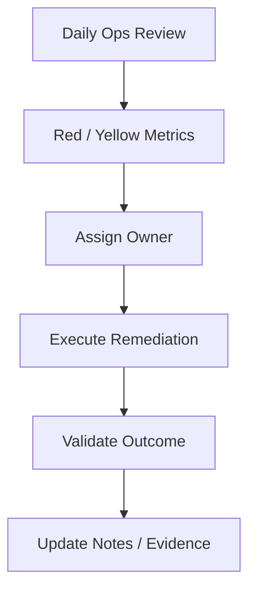

# Operations Endpoint Scorecard  
**Daily Operational Control, Triage, and Trend Management**

---

## Purpose

This document defines the **operations-facing endpoint scorecard** for Windows 11 devices managed with Microsoft Intune.

The operations scorecard exists to:
- Surface actionable issues early
- Drive daily and weekly operational priorities
- Reduce mean time to detection (MTTD) and resolution (MTTR)
- Feed accurate, aggregated signals into executive scorecards
- Maintain continuous audit readiness

This is a **working dashboard**, not a presentation artifact.

---

## Design Principles

Operations scorecards must be:

1. **Actionable**
2. **Near real-time**
3. **Trend-aware**
4. **Owner-mapped**
5. **Noise-controlled**
6. **Evidence-backed**

If a metric does not trigger an action, it does not belong here.

---

## Scorecard Cadence

| Cadence | Use |
---|---|
| Daily | Triage and incident detection |
| Weekly | Trend analysis and backlog reduction |
| Monthly | Input to executive scorecards |

---

## Core Operational Domains (Authoritative)

The operations scorecard is divided into **six domains**:

1. Device Compliance
2. Update & Servicing
3. Application Reliability
4. Endpoint Stability
5. Security Signal Health
6. Lifecycle Operations

---

## 1. Device Compliance Scorecard

### Objective
Identify and remediate **trust posture failures** before access impact escalates.

| Metric | Threshold | Action |
---|---|---|
| Non-compliant devices | > 2% | Investigate root cause |
| Grace period expiring (48h) | > 0 | Prioritize remediation |
| Repeat offenders | Any | Escalate |
| Compliance evaluation failures | Any | Fix policy / device |

**Primary Actions**
- Force device sync
- Trigger remediation
- Reset or wipe repeat offenders

**Evidence Source**
- Intune device compliance reports
- Device timelines

---

## 2. Update & Servicing Scorecard

### Objective
Ensure **security SLAs** for updates are met without destabilizing the fleet.

| Metric | Threshold | Action |
---|---|---|
| Missed quality update deadlines | > 0 | Immediate remediation |
| Update failure rate | > 5% | Pause ring |
| Rollback events | Any | Root cause analysis |
| Ring progression lag | Any | Validate assignments |

**Primary Actions**
- Pause affected ring
- Initiate rollback playbook
- Fix driver or update conflicts

**Evidence Source**
- Intune update reports
- Device update timelines

---

## 3. Application Reliability Scorecard

### Objective
Detect application issues that affect productivity or enrollment integrity.

| Metric | Threshold | Action |
---|---|---|
| App install failure rate | > 5% | Fix package |
| ESP app failures | Any | Remove from ESP |
| Supersedence failures | Any | Block rollout |
| Reinstall loops | Any | Fix detection |

**Primary Actions**
- Validate detection rules
- Repackage app
- Execute supersedence rollback

**Evidence Source**
- Intune app reports
- Win32 install logs

---

## 4. Endpoint Stability Scorecard

### Objective
Maintain **platform stability** while enforcing security controls.

| Metric | Threshold | Action |
---|---|---|
| BSOD spike | Any trend | Investigate immediately |
| Boot time regression | Sustained | Correlate changes |
| Unexpected reboots | > baseline | Investigate |
| Hardware-specific failures | Any | Isolate model |

**Primary Actions**
- Correlate with updates or drivers
- Initiate rollback
- Quarantine affected hardware

**Evidence Source**
- Endpoint Analytics
- Device health metrics

---

## 5. Security Signal Health Scorecard

### Objective
Ensure **security telemetry is complete and reliable**.

| Metric | Threshold | Action |
---|---|---|
| Defender reporting gaps | > 0 | Immediate remediation |
| High-risk devices | Any | Incident response |
| ASR failures | Any | Policy correction |
| EDR onboarding failures | Any | Fix deployment |

**Primary Actions**
- Reapply security baseline
- Isolate device if required
- Trigger IR workflow

**Evidence Source**
- Microsoft Defender
- Intune security reports

---

## 6. Lifecycle Operations Scorecard

### Objective
Control **device transitions** and prevent stale or orphaned assets.

| Metric | Threshold | Action |
---|---|---|
| Devices pending reset | > SLA | Execute reset |
| Orphaned devices | Any | Decommission |
| Reassignment backlog | Any | Process |
| Failed wipes | Any | Investigate |

**Primary Actions**
- Autopilot Reset
- Full wipe
- Asset record update

**Evidence Source**
- Intune device actions
- Asset management records

---

## Daily Triage Workflow

No metric remains unowned.

---

## Escalation Criteria

Immediate escalation required for:

- Mass compliance failure

- Widespread update failures

- Security signal loss

- ESP enrollment failures

- BSOD or boot-loop trends

Escalation must follow incident response integration procedures.

---

## Ops-to-Exec Rollup Rules

| Rule                     | Description             |
| ------------------------ | ----------------------- |
| Raw counts → percentages | Normalize for exec view |
| Single events → trends   | Avoid noise             |
| Actions → outcomes       | Focus on results        |
| Risks → mitigations      | No surprises            |

Ops scorecards feed, but do not replace, executive scorecards.

---

## Evidence and Audit Traceability

Every metric must map to:

- System of record (Intune, Entra ID, Defender)

- Exportable report

- Retained evidence per policy

Screenshots alone are not sufficient.

---

## Ownership and Accountability

| Role                 | Responsibility    |
| -------------------- | ----------------- |
| Endpoint Operations  | Daily review      |
| Endpoint Engineering | Remediation       |
| Security Operations  | Security signals  |
| Service Desk         | User coordination |
| Management           | Risk decisions    |

---

## Common Operational Anti-Patterns (Avoid)

| Anti-Pattern            | Impact            |
| ----------------------- | ----------------- |
| Ignoring yellow metrics | Delayed incidents |
| Manual endpoint fixes   | Drift             |
| No owner assigned       | Stagnation        |
| No trend analysis       | Repeat failures   |
| No evidence retention   | Audit failure     |

---

## Summary

The operations scorecard is the control panel for endpoint management.

It ensures that:

- Issues are detected early

- Remediation is deliberate

- Stability is preserved

- Security is enforced

- Leadership reporting is accurate

Well-run operations make executive dashboards boringly green.

---

## Section Status

Operations scorecard framework complete.
