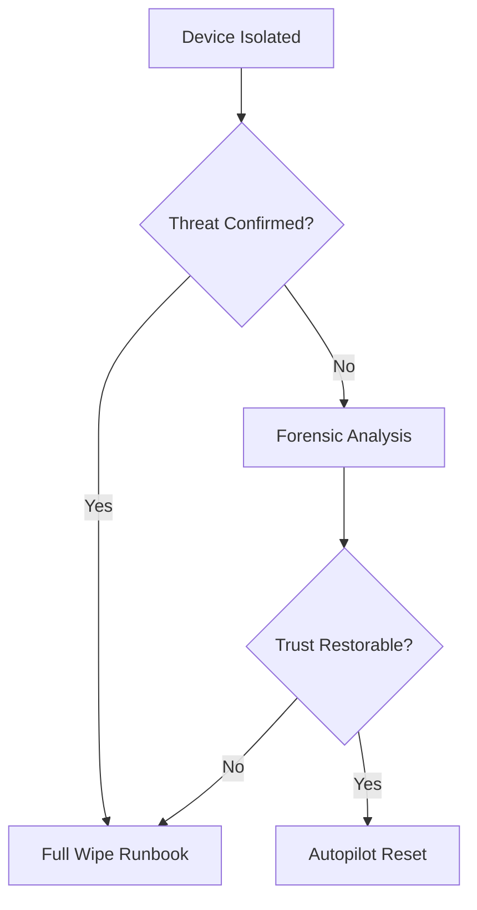

# Incident Device Isolation Runbook  
**Immediate Containment of Suspected or Confirmed Endpoint Compromise**

---

## Purpose

This runbook defines the **authoritative procedure** for isolating a Windows 11 endpoint during a security incident.

Device isolation is a **containment action**, not a remediation.  
Its purpose is to:
- Immediately stop lateral movement
- Preserve forensic evidence
- Maintain device power and state
- Enable safe investigation and recovery

Isolation must be **fast, decisive, and logged**.

---

## When to Isolate a Device (Mandatory)

Device isolation **must** be executed when any of the following occur:

| Trigger | Example |
---|---|
| Defender High or Critical alert | Malware detected |
| Confirmed credential compromise | Device involved |
| Active command-and-control traffic | Defender telemetry |
| Suspicious lateral movement | SIEM correlation |
| Security Operations directive | Incident commander |

Delay increases damage.

---

## When NOT to Isolate

| Scenario | Action Instead |
---|---|
| Lost or stolen device | Full Wipe |
| Device offline | Assume hostile, revoke access |
| Post-incident cleanup | Follow wipe/reset runbook |
| Non-security performance issue | Operations workflow |

Isolation is **not** a substitute for wipe.

---

## Preconditions (FAST CHECK)

Before isolating, confirm:

- [ ] Correct device identified (name, serial, user)
- [ ] Incident declared or approved by Security
- [ ] Device is currently online (if offline, skip isolation)
- [ ] Evidence capture initiated (where possible)

If time is critical, proceed and document afterward.

---

## Access Requirements

The operator must have:

| Requirement | Notes |
---|---|
| Defender role | Security Operator or higher |
| Intune visibility | For device context |
| Incident record | Active |

---

## Primary Isolation Method (Authoritative)

**Microsoft Defender for Endpoint – Device Isolation**

### Defender Portal Path

### Microsoft 365 Defender portal
→ Devices
→ Select device
→ Isolate device

Isolation uses Defender-controlled network filtering and does **not** power off the device.

---

## Isolation Mode

| Mode | Use |
---|---|
| Full isolation | Default |
| Selective isolation | Only with security approval |

Selective isolation must be justified and documented.

---

## Expected Isolation Outcomes

| Component | Outcome |
---|---|
| Network access | Blocked (except Defender) |
| Lateral movement | Prevented |
| User access | Severely restricted |
| Device power | Maintained |
| Forensic state | Preserved |

---

## Immediate Post-Isolation Actions

Within **15 minutes**:

1. Confirm isolation status in Defender
2. Block user sign-in via Conditional Access (if not already)
3. Preserve logs and timelines
4. Notify Incident Commander
5. Suspend non-essential remediation actions

Do **not** reboot the device unless directed.

---

## Evidence Preservation (MANDATORY)

Before any remediation:

| Evidence | Source |
---|---|
| Defender alerts | Defender portal |
| Device timeline | Intune |
| Network activity | Defender |
| Sign-in logs | Entra ID |
| CA policy evaluations | Entra ID |

Evidence must be timestamped and exported.

---

## Next-Step Decision Tree

---

## Communication Protocol

| Audience             | Timing                          |
| -------------------- | ------------------------------- |
| Security Operations  | Immediate                       |
| Endpoint Engineering | Immediate                       |
| Service Desk         | After isolation                 |
| User                 | After containment, factual only |
| Management           | SEV-1 / SEV-2 only              |

User communication must avoid technical details.

---

## Failure Scenarios and Escalation

| Failure               | Action                      |
| --------------------- | --------------------------- |
| Isolation fails       | Revoke access, escalate     |
| Device offline        | Treat as hostile            |
| Wrong device isolated | Reverse immediately, notify |
| Evidence lost         | Document and escalate       |

## De-Isolation (Controlled)

Devices must not be removed from isolation until:

- Incident commander approval

- Root cause understood

- Recovery plan selected

- Evidence preserved

De-isolation without approval is prohibited.

---

## Evidence and Audit Artifacts

| Artifact          | Source              |
| ----------------- | ------------------- |
| Isolation action  | Defender audit logs |
| Incident timeline | SIEM / IR system    |
| CA access blocks  | Entra ID            |
| Recovery decision | Incident record     |

---

## Governance and Ownership

| Role                 | Responsibility     |
| -------------------- | ------------------ |
| Incident Commander   | Decision authority |
| Security Operations  | Execution          |
| Endpoint Engineering | Recovery support   |
| GRC                  | Evidence retention |

---

## Summary

Device isolation is the fastest way to stop damage during an endpoint incident.

When executed correctly:

- Threat spread is contained

- Evidence is preserved

- Recovery options remain open

- Audits are satisfied

When delayed or skipped:

- Damage multiplies

- Evidence is lost

- Risk escalates

---

## Runbook Status

☐ Draft

☐ Approved

☐ Operational

☐ Reviewed (Annual)

---

