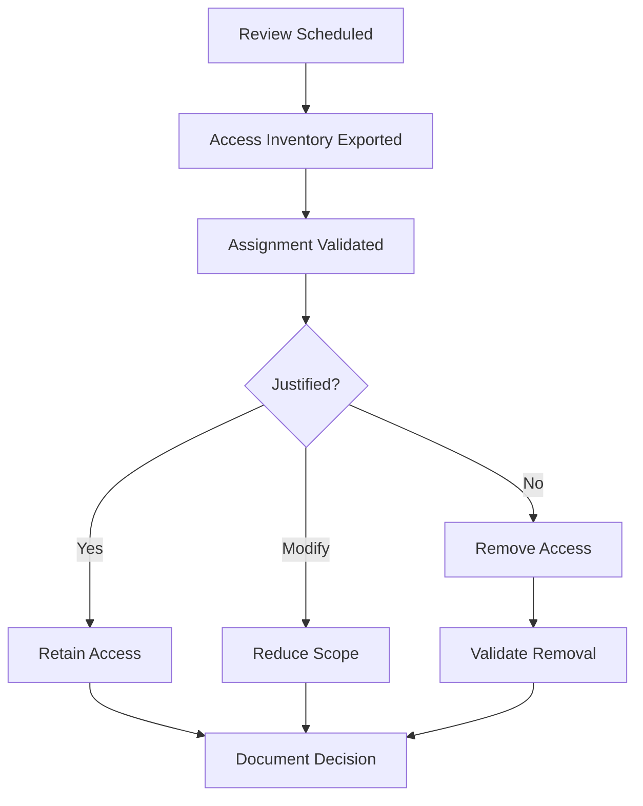

# Access Reviews  
**Operational Execution Guide for RBAC Recertification**

---

## Purpose

This document provides the **operational execution guide** for conducting access reviews across Microsoft Intune and Microsoft Entra ID.

It complements:
- RBAC design documentation
- Audit-readiness controls
- Governance policy requirements

This file answers the question:

> “How do we actually run access reviews, step by step, and prove it?”

---

## Scope

This guide applies to reviews of:

- Microsoft Entra ID privileged roles
- Intune RBAC role assignments
- Custom Intune roles
- Scope tag assignments
- Break-glass accounts
- Automation and service principals (where applicable)

---

## Guiding Principles

Access reviews must be:

1. **Scheduled**
2. **Repeatable**
3. **Owner-driven**
4. **Evidence-backed**
5. **Decisive**

An access review that does not result in **removals or confirmations** is a failure.

---

## Review Cadence (Summary)

| Access Type | Frequency |
---|---|
| Tier 0 (Identity / Security) | Quarterly |
| Tier 1 (Endpoint Admin) | Quarterly |
| Tier 2 (Service Desk) | Semi-Annual |
| Break-glass accounts | Monthly |
| Vendors / External | Quarterly |

---

## Roles and Responsibilities

| Role | Responsibility |
---|---|
| Security | Tier 0 access reviews |
| Endpoint Leadership | Tier 1 access reviews |
| IT Operations | Tier 2 access reviews |
| GRC | Evidence collection and audit |
| Management | Risk acceptance |

Every review must have a **named reviewer**.

---

## Review Workflow (Authoritative)

---

Step 1 — Inventory Collection
Entra ID

Export:

- Directory role assignments

- PIM eligible assignments

- PIM active assignments

- Break-glass accounts

Sources:

- Entra ID portal

- Entra ID audit logs

- PIM reports

---

## Intune

Export:

- RBAC role assignments

- Custom role definitions

- Scope tag assignments

- Assignment scopes

Sources:

- Intune admin center

- Intune audit logs

---

## Step 2 — Validation Criteria

Each assignment must answer YES to all:

- Is the role still required?

- Is the scope still correct?

- Is the access least-privileged?

- Is separation of duties preserved?

- Is the assignment time-bound where possible?

If any answer is NO, action is required.

---

## Step 3 — Decision Recording

Each assignment must be marked as:

| Decision  | Description            |
| --------- | ---------------------- |
| Retain    | Access still justified |
| Modify    | Reduce role or scope   |
| Remove    | No longer justified    |
| Exception | Temporary, time-bound  |

Silence is not an acceptable decision.

---

## Step 4 — Remediation Execution

Required actions:

- Remove role assignments

- Adjust scope tags

- Convert standing access to PIM

- Reduce custom role permissions

All changes must be:

- Logged

- Timestamped

- Attributable

---

## Step 5 — Validation

After remediation:

- Confirm access removal

- Validate no orphaned permissions

- Confirm PIM enforcement

- Re-run access inventory if necessary

Do not close the review until validation is complete.

---

## Step 6 — Documentation and Evidence

Each review cycle must produce:

| Artifact             | Requirement |
| -------------------- | ----------- |
| Review date          | Mandatory   |
| Scope reviewed       | Mandatory   |
| Reviewer name        | Mandatory   |
| Access inventory     | Attached    |
| Decisions log        | Attached    |
| Remediation evidence | Attached    |
| Exceptions (if any)  | Documented  |

Evidence must be stored in the central GRC repository.

---

## Exception Handling

Exceptions must:

- Be approved by management

- Have a business justification

- Be time-bound (≤ 90 days)

- Be reviewed at next cycle

Expired exceptions are treated as violations.

---

## Break-Glass Account Review

Monthly validation must confirm:

- Accounts exist

- Credentials are secured

- MFA excluded only where required

- No routine usage detected

- Emergency access only

Any routine usage is a security incident.

---

## Metrics and KPIs

| Metric                        | Target       |
| ----------------------------- | ------------ |
| Reviews completed on schedule | 100%         |
| Access removed per cycle      | Expected > 0 |
| Standing privileged access    | 0            |
| Evidence completeness         | 100%         |

---

## Common Failure Modes (Avoid)

| Failure             | Impact               |
| ------------------- | -------------------- |
| Informal reviews    | Audit failure        |
| No removals         | Privilege creep      |
| Missing evidence    | Control invalidation |
| Delayed remediation | Policy violation     |
| No named owner      | Accountability gap   |

---

## Audit Walkthrough Guidance

Auditors should be shown:

- Last completed access review

- Inventory export

- Decisions and removals

- Evidence retention

- Next scheduled review

This demonstrates operational maturity.

---

## Summary

Access reviews are the mechanism that keeps RBAC real.

When executed properly:

- Privilege creep is eliminated

- Risk decisions are explicit

- Audits are predictable

- Trust is maintained

When skipped:

- Controls silently decay

- Risk accumulates

- Failures appear during audits

---

## Document Status

☐ Draft

☐ Approved

☐ Operational

☐ Reviewed (Annual)
