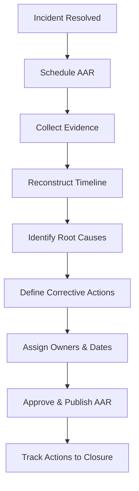

# After-Action Review (AAR) Runbook  
**Blameless Review, Evidence Preservation, and Continuous Improvement**

---

## Purpose

This runbook defines the **After-Action Review (AAR)** process for endpoint-related incidents and outages in a Windows 11 environment managed with Microsoft Intune.

The objectives are to:
- Establish a factual, blameless account of events
- Identify systemic and process-level improvements
- Ensure corrective actions are owned and tracked
- Preserve audit-ready evidence
- Reduce recurrence and mean time to recovery

An AAR is **mandatory** for significant events and is not optional.

---

## When an AAR Is Required

An AAR **must** be conducted for any of the following:

| Trigger |
---|
| SEV-1 or SEV-2 outage |
| Confirmed security incident |
| Repeated Tier 2 or Tier 3 escalations |
| Compliance or control failure |
| Audit finding |
| Executive-directed review |

For SEV-3/4 events, an AAR is **recommended** when patterns emerge.

---

## Principles

- **Blameless:** Focus on systems and processes, not individuals
- **Evidence-based:** Assertions must be supported by logs or records
- **Action-oriented:** Reviews without corrective actions are failures
- **Time-bound:** Improvements must have owners and deadlines
- **Transparent:** Findings are shared with appropriate stakeholders

---

## Roles and Responsibilities

| Role | Responsibility |
---|---|
| Incident Commander | Initiates AAR |
| Tier 3 / Engineering | Technical analysis |
| Security (if applicable) | Control integrity review |
| Operations | Process assessment |
| GRC | Evidence and audit alignment |
| Management | Risk acceptance and prioritization |

The Incident Commander ensures completion.

---

## AAR Timing

- AAR must be scheduled **within 5 business days** of incident resolution
- Documentation must be completed **within 10 business days**
- Corrective actions must have due dates agreed at review time

Delays reduce accuracy and value.

---

## AAR Workflow

---

### Step 1 — Evidence Collection

Collect and archive the following:

| Evidence                    | Source            |
| --------------------------- | ----------------- |
| Incident ticket             | Ticketing system  |
| Timeline of events          | Incident record   |
| Intune audit logs           | Intune            |
| Policy and assignment state | Intune            |
| Defender alerts (if any)    | Defender          |
| Change records              | Change system     |
| Communications              | Approved messages |

Evidence must be timestamped and immutable.

### Step 2 — Timeline Reconstruction

Reconstruct a fact-based timeline including:

- Initial trigger or change

- First observable symptoms

- Detection method

- Escalation points (Tier 1 → 2 → 3 / Security)

- Mitigation actions

- Resolution point

- Recovery validation

Avoid assumptions. Use logs wherever possible.

### Step 3 — Impact Assessment

Document impact in business terms:

| Area              | Description                  |
| ----------------- | ---------------------------- |
| Users affected    | Number and roles             |
| Duration          | Start to resolution          |
| Services impacted | Sign-in, apps, updates       |
| Data impact       | None / suspected / confirmed |
| Compliance impact | Yes / No                     |
| Financial impact  | If known                     |

Impact framing is essential for prioritization.

### Step 4 — Root Cause Summary

Summarize root causes and contributing factors, using categories:

| Category      | Example            |
| ------------- | ------------------ |
| Architecture  | Ring design gap    |
| Configuration | Mis-scoped policy  |
| Process       | Missing validation |
| Governance    | Excess privilege   |
| Monitoring    | Alert blind spot   |
| Documentation | Ambiguity          |

Multiple causes are common and expected.

### Step 5 — Corrective and Preventive Actions (CAPA)

Define actions across three dimensions:

Corrective Actions

Immediate fixes to address the issue.

Preventive Actions

Changes to prevent recurrence.

Detective Actions

Monitoring or alerts to detect early.

Each action must include:

- Description

- Owner

- Priority

- Due date

- Validation method

Unowned actions are invalid.

### Step 6 — Risk Review and Acceptance

If any action:

- Reduces security controls

- Introduces temporary exceptions

- Defers remediation

Then:

- Risk must be explicitly documented

- Risk owner identified

- Time-bound acceptance defined

- Management approval obtained

No silent risk acceptance.

### Step 7 — Approval and Publication

The completed AAR must be:

- Reviewed by Engineering and Security (if applicable)

- Approved by Operations leadership

- Archived in the evidence repository

Referenced in the Decision Log if architectural changes occur

### Step 8 — Tracking and Closure

- Corrective actions tracked to completion

- Status reviewed periodically

- Closure recorded once all actions complete or accepted

- Re-open AAR if recurrence occurs

### Metrics and Continuous Improvement

Track and review:

| Metric                      |
| --------------------------- |
| Time to detection           |
| Time to containment         |
| Time to recovery            |
| Repeat incident rate        |
| % actions completed on time |

Metrics inform roadmap and training.

---

### Common Failure Modes (Avoid)

| Failure              | Impact             |
| -------------------- | ------------------ |
| Blame-focused review | No improvement     |
| Missing evidence     | Audit risk         |
| Vague action items   | No accountability  |
| Skipped approvals    | Governance failure |
| No follow-up         | Recurrence         |

---

### Summary

The After-Action Review converts incidents into organizational learning.

When executed correctly:

- Systems improve

- Processes mature

- Risk decreases

- Audits are defensible

- Confidence increases

An incident without an AAR is wasted pain.

---

### Runbook Status

☐ Draft

☐ Approved

☐ Operational

☐ Reviewed (Annual)
