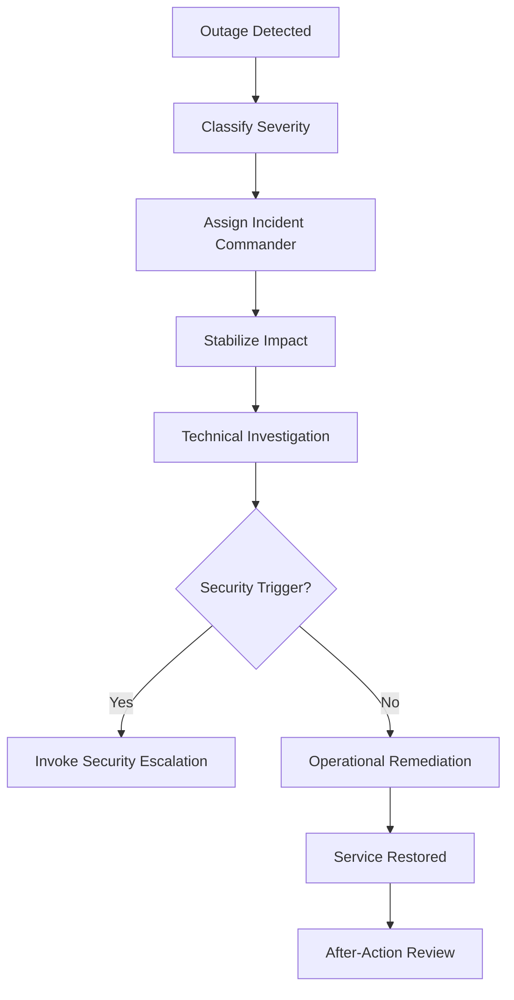

# Outage Response Runbook  
**Endpoint Service Disruption and Business Impact Management**

---

## Purpose

This runbook defines the **standard response process for endpoint-related outages** impacting Windows 11 devices managed with Microsoft Intune.

Its objectives are to:
- Rapidly stabilize user impact
- Coordinate Tier 1, Tier 2, Tier 3, and Security appropriately
- Maintain clear command-and-control during incidents
- Communicate accurately and consistently
- Preserve audit and post-incident evidence

An outage is a **service availability event**, not automatically a security incident.

---

## Definition of an Outage

An outage exists when one or more of the following occur:

- Large numbers of users cannot sign in
- Devices fail to enroll or provision
- Required applications fail broadly
- Updates cause widespread instability
- Intune-dependent services are unavailable
- Business operations are materially impacted

Severity is based on **business impact**, not technical complexity.

---

## Severity Classification

| Severity | Description |
---|---|
| SEV-1 | Critical business outage (enterprise-wide) |
| SEV-2 | Major degradation (multiple teams) |
| SEV-3 | Limited impact (subset of users) |
| SEV-4 | Minor issue or workaround available |

Severity determines **response urgency and escalation path**.

---

## Authority and Roles

| Role | Responsibility |
---|---|
| Incident Commander | Overall coordination |
| Tier 1 | Intake, user communication |
| Tier 2 | Technical remediation |
| Tier 3 | Systemic fixes |
| Security | Only if security triggers present |
| Communications | User and leadership updates |
| Management | Business decisions |

Only one **Incident Commander** is designated per outage.

---

## Outage Response Workflow

---

### Step 1 — Detection and Declaration

Outages may be detected via:

- User reports

- Monitoring dashboards

- Microsoft service advisories

- Tier 1 trend analysis

Once confirmed:

- Assign severity

- Open incident record

- Appoint Incident Commander

Do not delay declaration while “investigating quietly.”

### Step 2 — Immediate Stabilization

Priority actions:

- Stop recent changes (change freeze)

- Prevent further rollout (pause rings/apps if needed)

- Preserve current state

- Identify blast radius

Avoid speculative fixes.

### Step 3 — Investigation and Remediation
Tier 2 Focus

- Validate policy and assignment changes

- Identify recent updates or deployments

- Test remediation on limited scope

- Apply rollback where supported

Tier 3 Focus

- Identify systemic design or process failures

- Coordinate structural fixes

- Approve controlled changes

### Step 4 — Security Decision Point

If any of the following appear:

- Defender alerts

- Unexplained device behavior

- Credential anomalies

- Unexpected lateral impact

Immediately invoke Security Escalation Runbook.

Outage response pauses until Security clears.

### Step 5 — Communication Plan
Internal Updates

| Audience      | Frequency    |
| ------------- | ------------ |
| IT Operations | As needed    |
| Leadership    | SEV-based    |
| Service Desk  | Regular      |
| Security      | If triggered |

### User Communications

- Clear, factual, non-technical

- No speculation or blame

- No security detail unless approved

- Regular cadence for SEV-1/2

### Step 6 — Resolution and Validation

Before declaring resolution:

- Services restored for affected users

- No new incidents observed

- Monitoring confirms stability

- Workarounds removed or documented

Do not close incident prematurely.

### Step 7 — Closure and Handoff

Upon resolution:

- Record resolution time

- Capture remediation actions

- Identify follow-up tasks

- Schedule After-Action Review (AAR)

---

### Evidence and Audit Artifacts

| Artifact          | Source             |
| ----------------- | ------------------ |
| Incident timeline | Ticketing system   |
| Change records    | Change system      |
| Communications    | Approved templates |
| Remediation logs  | Intune / systems   |
| RCA / AAR         | Engineering        |

Outage records are audit-relevant.

---

### Common Failure Modes (Avoid)

| Failure                    | Impact          |
| -------------------------- | --------------- |
| No incident commander      | Chaos           |
| Overlapping fixes          | Extended outage |
| Poor communication         | User distrust   |
| Skipping RCA               | Recurrence      |
| Mixing outage and security | Confusion       |

---

### Summary

Effective outage response requires:

- Clear authority

- Disciplined actions

- Honest communication

- Structured follow-up

Outages are inevitable.
Disorganized response is not.

---

### Runbook Status

☐ Draft

☐ Approved

☐ Operational

☐ Reviewed (Annual)
