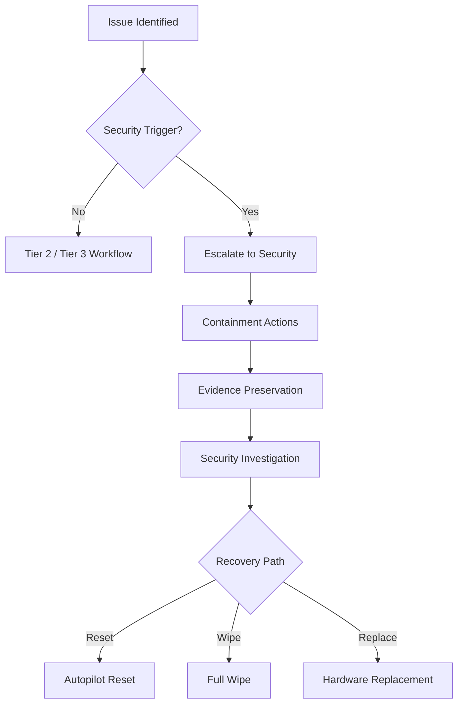

# Security Escalation Runbook  
**Endpoint Security Incident Escalation and Containment**

---

## Purpose

This runbook defines the **mandatory security escalation process** for Windows 11 endpoints managed with Microsoft Intune and Microsoft Defender for Endpoint.

Its objectives are to:
- Ensure timely escalation of suspected or confirmed security incidents
- Preserve evidence and prevent contamination
- Clearly separate operational remediation from security response
- Enable consistent, auditable incident handling
- Reduce decision ambiguity during high-pressure events

When security escalation is required, **speed and discipline matter more than convenience**.

---

## Scope

### In Scope

This runbook applies to:
- Suspected or confirmed endpoint compromise
- Defender alerts requiring investigation
- Credential exposure involving endpoints
- Unexplained or anomalous endpoint behavior
- Compliance failures with security impact
- Incidents requiring evidence preservation

---

### Out of Scope

This runbook does **not** cover:
- Routine operational issues
- Performance-only problems
- Non-security compliance drift
- Architecture redesign (Tier 3)
- User error without security implication

---

## Authority and Ownership

| Role | Responsibility |
---|---|
| Security Operations | Incident ownership and response |
| Tier 1 / Tier 2 | Detection and escalation only |
| Endpoint Engineering | Recovery support (post-containment) |
| GRC / Legal | Evidence, notification, compliance |
| Management | Risk and business decisions |

Once escalated, **Security Operations owns the incident**.

---

## Mandatory Escalation Triggers

Escalate to Security **immediately** if **any** of the following occur:

| Trigger |
---|
| Defender High or Critical alert |
| Suspected malware or ransomware |
| Unexpected admin behavior |
| Credential compromise suspected |
| Device communicating with known malicious IPs |
| Repeated unexplained compliance failure |
| Evidence of lateral movement |
| Security team directive |

If unsure, **escalate**.

---

## Escalation Workflow

---

### Step 1 — Immediate Actions (Pre-Escalation)

Before escalating, do not attempt remediation.

Required actions:

- Stop all non-essential actions on the device

- Capture current device identifiers

- Note timestamps and observations

- Preserve logs where possible

Do not reboot, reset, or wipe unless instructed by Security.

### Step 2 — Escalation Procedure

Escalate via the approved incident channel with:

- User identity

- Device name and serial

- Description of observed behavior

- Relevant Defender alert IDs

- Actions already taken (if any)

- Time of detection

Incomplete escalation delays response.

### Step 3 — Containment (Security-Led)

Security Operations may execute:

- Device isolation (Defender)

- Account disablement

- Token revocation

- Network containment

- Conditional Access restrictions

Operations teams must not interfere during containment.

### Step 4 — Evidence Preservation

Security ensures preservation of:

| Evidence           | Source          |
| ------------------ | --------------- |
| Defender alerts    | Defender portal |
| Device timeline    | Defender        |
| Sign-in logs       | Entra ID        |
| Intune audit logs  | Intune          |
| Network indicators | SIEM / Defender |

Evidence handling follows legal and regulatory guidance.

### Step 5 — Communication Rules

During an active security incident:

- No user communication without Security approval

- No speculation or root cause discussion

- No attribution of fault

- No written guarantees

All external communication is coordinated by Security and Legal.

### Step 6 — Recovery Handoff

Once containment is complete, Security will direct recovery via:

- Autopilot Reset

- Full device wipe

- Hardware replacement

- Credential reset and revalidation

Tier 2 and Tier 3 support recovery only after authorization.

### Step 7 — Post-Incident Requirements

After incident closure:

- Tier 3 RCA is mandatory

- Evidence archived per policy

- Lessons learned documented

- Control improvements prioritized

Executive summary produced (for major incidents)

---

### Audit and Governance Notes

- All security escalations are auditable events

- Failure to escalate is a policy violation

- Unauthorized remediation during incidents is prohibited

- Incident records must be retained per policy

---

### Common Failure Modes (Avoid)

| Failure                    | Impact          |
| -------------------------- | --------------- |
| Delayed escalation         | Expanded breach |
| Premature remediation      | Evidence loss   |
| Unauthorized communication | Legal exposure  |
| Overlapping authority      | Confusion       |
| Poor documentation         | Audit findings  |

---

### Summary

Security escalation is a control boundary, not a courtesy.

When followed correctly:

- Threats are contained quickly

- Evidence is preserved

- Recovery is controlled

- Audit and legal risk is minimized

When bypassed:

- Incidents worsen

- Evidence is lost

- Accountability fails

---

### Runbook Status

☐ Draft

☐ Approved

☐ Operational

☐ Reviewed (Annual)
