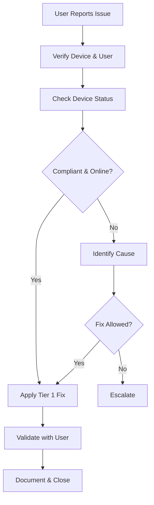

# Tier 1 Triage Runbook  
**Windows 11 Intune-Managed Endpoints**

---

## Purpose

This runbook defines the **authorized Tier 1 triage process** for Windows 11 devices managed with Microsoft Intune.

Its goals are to:
- Restore user productivity quickly
- Prevent unnecessary escalation
- Avoid actions that could increase security or audit risk
- Ensure consistent documentation and handoff
- Enforce clear boundaries between Tier 1, Tier 2, and Security

Tier 1 triage focuses on **symptom identification and safe remediation**, not root-cause engineering.

---

## Scope

### In Scope (Tier 1 Authorized)

- Initial user issue intake
- Device status verification
- Basic remediation actions
- Safe resets and sync actions
- User guidance and communication
- Ticket documentation and escalation

---

### Out of Scope (Must Escalate)

Tier 1 **must not**:
- Modify Intune policies or assignments
- Disable security controls
- Change Conditional Access
- Perform forensic analysis
- Bypass compliance enforcement
- Manually modify registry, BitLocker, or Defender settings

---

## Access Requirements

Tier 1 operators must have:

| Requirement | Notes |
---|---|
| Intune role | Help Desk Operator (or equivalent) |
| Scope tags | Only assigned operational scope |
| Ticketing access | Mandatory |
| Audit awareness | Required |

If access exceeds this scope, it is a **governance issue**.

---

## Standard Triage Flow

---

Step 1 — Intake and Verification

Collect and verify:

- User identity

- Device name or serial number

- Issue description (user words)

- Start time and impact

- Any recent changes (updates, travel, password reset)

Confirm:

- Correct user-device association

- Device is corporate-owned

---

Step 2 — Device Status Check (Intune)

Verify the following in Intune:

| Check             | Expected                      |
| ----------------- | ----------------------------- |
| Device exists     | Yes                           |
| Device ownership  | Corporate                     |
| Enrollment status | Enrolled                      |
| Compliance        | Compliant (or reason visible) |
| Last check-in     | < 24 hours                    |

---

Step 3 — Common Issue Categories
3.1 Sign-In or Access Issues

Checks

- Is device compliant?

- Is user blocked by Conditional Access?

- Has password recently changed?

Allowed Actions

- Instruct user to connect to network

- Trigger device sync

- Have user sign out / sign in

- Validate time/date accuracy

Escalate if

- Compliance failure reason unclear

- CA policy blocking persists

- Repeated failures

---

3.2 Application Issues

Checks

- Is app required or available?

- App install status in Intune

- Recent app update or supersedence

Allowed Actions

- Trigger sync

- Guide user to Company Portal

- Reboot device

Escalate if

- App repeatedly fails

- Business-critical outage

- ESP-related failure

---

3.3 Update or Performance Issues

Checks

- Pending Windows updates

- Recent feature update

- Known outage or maintenance window

Allowed Actions

- Trigger update check

- Schedule reboot

- Inform user of update timelines

Escalate if

- Boot failures

- Repeated blue screens

- Post-update instability

---

3.4 Device Sync and Policy Issues

Allowed Actions

- Trigger Intune sync

- Restart Intune Management Extension

- Reboot device

Not Allowed

- Manual policy removal

- Registry edits

- Local admin elevation

---

Step 4 — Approved Tier 1 Remediation Actions

Tier 1 may perform:

- Device sync

- Reboot guidance

- Company Portal reinstall (if documented)

- Autopilot Reset only if pre-approved by policy

- Password sign-out / sign-in guidance

Tier 1 may not:

- Wipe devices without approval

- Remove devices from Intune

- Bypass security controls

---

Step 5 — When to Escalate

Escalate immediately if:

| Condition                    | Escalation        |
| ---------------------------- | ----------------- |
| Suspected security incident  | Security          |
| Repeated compliance failures | Tier 2            |
| Encryption errors            | Tier 2            |
| Autopilot / ESP failure      | Tier 2            |
| Hardware failure             | Tier 2            |
| Data loss risk               | Tier 2 / Security |

Escalation is a success condition, not a failure.

---

Step 6 — Documentation Requirements

Every ticket must include:

- User and device identifiers

- Symptoms observed

- Checks performed

- Actions taken

- Outcome

- Escalation details (if any)

Incomplete documentation is non-compliant.

---

Communication Guidelines

- Use clear, non-technical language with users

- Do not speculate or assign blame

- Do not promise timelines outside authority

- Do not mention internal security controls

---

Audit and Governance Notes

- Tier 1 actions are logged and reviewable

- Deviations from this runbook require approval

- Repeated escalations should be analyzed for root cause

---

Summary

Tier 1 triage is about:

- Fast, safe stabilization

- Clear boundaries

- Proper escalation

- Clean documentation

When done correctly:

- Users are helped quickly

- Security posture is preserved

- Operations scale predictably

---

Runbook Status

☐ Draft

☐ Approved

☐ Operational

☐ Reviewed (Annual)

---

