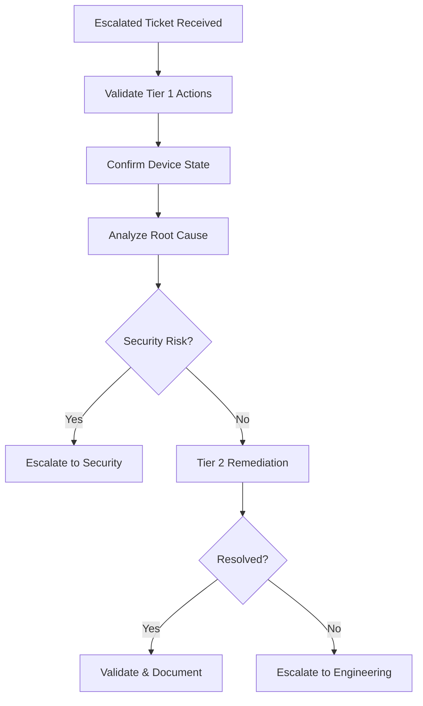

# Tier 2 Escalation Runbook  
**Advanced Endpoint Remediation and Controlled Escalation**

---

## Purpose

This runbook defines the **Tier 2 escalation and remediation process** for Windows 11 endpoints managed with Microsoft Intune.

Tier 2 acts as the **technical resolution layer** between:
- Tier 1 Service Desk (intake and basic remediation)
- Security Operations (incident response and containment)
- Endpoint Engineering (architecture and systemic fixes)

Tier 2 resolves **complex but non-incident issues** and determines when escalation is mandatory.

---

## Scope

### In Scope (Tier 2 Authorized)

Tier 2 may perform:

- Advanced device diagnostics
- Compliance failure analysis
- Encryption and TPM troubleshooting
- Autopilot and ESP failure remediation
- Application deployment failure analysis
- Update and servicing remediation
- Controlled device reset actions
- Root cause identification for recurring Tier 1 issues

---

### Out of Scope (Must Escalate)

Tier 2 **must not**:

- Disable or weaken security baselines
- Modify Conditional Access policies
- Suppress Defender alerts
- Perform forensic investigation
- Make architecture-wide changes without approval
- Override compliance enforcement permanently

These actions require **Security or Engineering escalation**.

---

## Access Requirements

Tier 2 operators must have:

| Requirement | Notes |
---|---|
| Intune role | Endpoint Administrator (scoped) |
| Scope tags | Assigned operational domains only |
| Defender visibility | Read-only unless approved |
| Ticketing access | Mandatory |
| Change awareness | Required |

Excess access beyond Tier 2 scope is a **governance violation**.

---

## Escalation Entry Criteria

Issues escalate to Tier 2 when:

| Trigger | Source |
---|---|
| Tier 1 remediation failed | Tier 1 |
| Compliance failure unclear | Intune |
| ESP or Autopilot failure | Enrollment |
| Encryption / TPM errors | Security baseline |
| Repeated incidents | Trend analysis |
| Business-critical outage | Operations |

Tier 2 should **not** receive untriaged tickets.

---

## Tier 2 Diagnostic Flow

## Step 1 — Validate Tier 1 Actions

Before taking action:

- Review Tier 1 documentation

- Confirm checks and actions performed

- Identify gaps or missteps

- Avoid repeating identical actions

If Tier 1 steps were incomplete, return ticket with guidance.

---

## Step 2 — Device State Verification

Confirm in Intune and related systems:

| Check         | Expected        |
| ------------- | --------------- |
| Enrollment    | Active          |
| Ownership     | Corporate       |
| Compliance    | State + reason  |
| Encryption    | Enabled / error |
| Defender      | Onboarded       |
| Last check-in | Recent          |
| Update state  | Visible         |

Discrepancies must be explained before remediation.

---

### Step 3 — Common Tier 2 Scenarios
3.1 Compliance Failures

Examples

- BitLocker key escrow failures

- TPM attestation errors

- Secure Boot non-compliance

Authorized Actions

- Trigger compliance re-evaluation

- Validate hardware compatibility

- Coordinate controlled Autopilot Reset

Escalate if

- Repeated failures

- Hardware defects suspected

- Security baseline regression

---

## 3.2 Autopilot / ESP Failures

Examples

- ESP timeout

- Required app blocking ESP

- Enrollment loops

Authorized Actions

- Identify blocking app or policy

- Remove device from ESP (if approved)

- Autopilot Reset and retry

Escalate if

- Pattern affects multiple devices

- Baseline design issue suspected

## 3.3 Application Deployment Failures

Examples

- Win32 detection failures

- Supersedence conflicts

- Install loops

Authorized Actions

- Review detection logic

- Validate supersedence chain

- Retry deployment after reset

Escalate if

- Packaging defect identified

- Widespread impact

## 3.4 Update and Servicing Issues

Examples

- Feature update stuck

- Post-update instability

- Driver conflicts

Authorized Actions

- Validate update ring targeting

- Trigger rollback (where supported)

- Coordinate Autopilot Reset if required

Escalate if

- Security update failure

- Multiple-device pattern

---

### Step 4 — Approved Tier 2 Remediation Actions

Tier 2 may perform:

- Autopilot Reset

- Device reprovisioning

- Controlled device wipe (with approval)

- Temporary device reassignment

- App redeployment

Tier 2 must not:

- Remove security baselines

- Disable compliance enforcement

- Grant permanent exceptions

---

### Step 5 — Escalation to Security

Escalate immediately if:

| Condition                      |
| ------------------------------ |
| Defender alerts present        |
| Suspected compromise           |
| Credential exposure            |
| Unexpected device behavior     |
| Evidence preservation required |

When escalating:

- Stop remediation

- Preserve logs

- Document timeline

---

### Step 6 — Escalation to Endpoint Engineering

Escalate to Engineering when:

- Issue is systemic

- Policy or architecture change required

- Multiple devices affected

- Design flaw identified

Engineering escalation must include:

- Root cause analysis

- Reproduction steps

- Impact assessment

---

### Documentation Requirements

Tier 2 tickets must include:

- Root cause identified (or hypothesis)

- Evidence reviewed

- Actions taken

- Escalation decisions

- Final outcome

Incomplete documentation is non-compliant.

---

### Metrics and Feedback Loop

Tier 2 should track:

- Repeated escalation patterns

- Common failure causes

- Time-to-resolution

- Tier 1 training gaps

These inputs feed continuous improvement.

### Audit and Governance Notes

- Tier 2 actions are auditable

- Deviations require approval

- Repeated emergency actions indicate design debt

---

Summary

Tier 2 escalation exists to:

- Resolve complex issues safely

- Protect security posture

- Identify systemic problems

- Feed improvements upstream

Tier 2 is resolution-focused, not workaround-driven.

---

Runbook Status

☐ Draft

☐ Approved

☐ Operational

☐ Reviewed (Annual)

---

