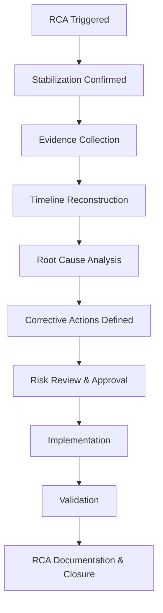

# Tier 3 Root Cause Analysis (RCA) Runbook  
**Systemic Issue Analysis, Architectural Correction, and Prevention**

---

## Purpose

This runbook defines the **Tier 3 root cause analysis (RCA) process** for Windows 11 endpoints managed with Microsoft Intune.

Tier 3 is responsible for:
- Identifying **systemic and architectural causes**
- Correcting design, configuration, or process defects
- Preventing recurrence through durable controls
- Producing audit-ready RCA documentation
- Feeding improvements back into architecture and operations

Tier 3 does **not** focus on immediate restoration — that is Tier 1/2.  
Tier 3 focuses on **why the issue was possible**.

---

## Scope

### In Scope (Tier 3 Authority)

Tier 3 may:

- Perform deep configuration and architectural analysis
- Modify Intune policies, baselines, and assignments (with approval)
- Redesign Autopilot, ESP, app, update, or compliance patterns
- Author or update runbooks and standards
- Implement permanent fixes
- Recommend governance or process changes
- Define new validation and monitoring controls

---

### Out of Scope (Requires Separate Authority)

Tier 3 must not unilaterally:

- Accept business risk without executive approval
- Suppress security controls permanently
- Modify identity-wide Conditional Access without Security approval
- Bypass change management
- Close incidents without documented RCA

---

## Access Requirements

Tier 3 engineers must have:

| Requirement | Notes |
---|---|
| Intune role | Endpoint Administrator / custom engineering role |
| Scope tags | Full engineering scope |
| Entra ID access | Read or delegated per change |
| Defender visibility | Read-only unless security-approved |
| Change system access | Mandatory |
| RCA template access | Mandatory |

Excess or standing privilege must be governed by PIM.

---

## RCA Entry Criteria

An issue requires Tier 3 RCA when **any** of the following are true:

| Trigger |
---|
| Repeated Tier 2 escalations |
| Multi-device impact |
| Production outage |
| Security control failure |
| Compliance drift |
| Incident post-mortem |
| Audit finding |
| Executive escalation |

Tier 3 RCA is **mandatory**, not optional, for these conditions.

---

## RCA Principles

- Focus on **systems, not people**
- Assume good intent
- Prefer evidence over theory
- Identify *contributing factors*, not a single cause
- Fix root causes, not symptoms
- Document decisions and tradeoffs

---

## RCA Workflow (Authoritative)

---

### Step 1 — Confirm Stabilization

Before RCA begins:

- Incident is contained

- User impact stabilized

- No active remediation underway

- Security has completed containment (if applicable)

RCA must not interfere with active response.

### Step 2 — Evidence Collection

Collect and preserve:

| Evidence                       | Source           |
| ------------------------------ | ---------------- |
| Intune audit logs              | Intune           |
| Policy and assignment state    | Intune           |
| Compliance evaluation history  | Intune           |
| Defender alerts (if any)       | Defender         |
| Update and app deployment logs | Intune           |
| Ticket timelines               | Ticketing system |
| Change records                 | Change system    |

Evidence must be timestamped and immutable once archived.

### Step 3 — Timeline Reconstruction

Build a factual timeline:

- Initial change or trigger

- First observable symptom

- Detection point

- Escalation points (Tier 1 → 2 → 3)

- Mitigation actions

- Resolution

Avoid assumptions. Use logs wherever possible.

### Step 4 — Root Cause Analysis
Recommended Techniques

Tier 3 may use:

- Five Whys

- Fault tree analysis

- Change correlation

- Control gap analysis

Root Cause Categories

| Category      | Examples           |
| ------------- | ------------------ |
| Architecture  | Poor ring design   |
| Configuration | Mis-scoped policy  |
| Process       | Missing validation |
| Governance    | Excess privilege   |
| Monitoring    | Blind spots        |
| Documentation | Ambiguity          |

Multiple root causes are common.

### Step 5 — Corrective and Preventive Actions (CAPA)

Define actions in three categories:

5.1 Corrective Actions

Immediate fixes to resolve the issue.

5.2 Preventive Actions

Changes that prevent recurrence.

5.3 Detective Actions

New monitoring, alerts, or validation.

Each action must have:

- Owner

- Priority

- Due date

### Step 6 — Risk Review and Approval

If corrective actions:

- Reduce security controls

- Introduce temporary exceptions

- Change compliance posture

Then:

- Security approval is required

- Risk acceptance must be documented

- Time bounds must be defined

No silent risk acceptance is allowed.

### Step 7 — Implementation

- Changes follow change management

- Non-production first (where applicable)

- Pilot validation required

- Rollback plan defined

Emergency changes must be documented post-hoc.

### Step 8 — Validation

Validate that:

- Issue no longer occurs

- No regressions introduced

- Monitoring detects similar failures

- Documentation is updated

Validation evidence must be attached to the RCA.

### Step 9 — RCA Documentation

RCA documentation must include:

- Executive summary

- Impact assessment

- Timeline

- Root cause(s)

- Contributing factors

- Corrective actions

- Preventive actions

- Evidence references

- Approvals

RCA records are audit artifacts.

---

### Escalation and Communication

| Audience             | Purpose             |
| -------------------- | ------------------- |
| Security             | Control integrity   |
| Endpoint Engineering | Design correction   |
| Operations           | Process improvement |
| Management           | Risk awareness      |
| GRC                  | Evidence retention  |

RCA findings must be shared appropriately.

---

### Metrics and Continuous Improvement

Track:

- RCA frequency

- Recurring root causes

- Time to permanent fix

- Control improvements implemented

Trends inform roadmap priorities.

---

### Common Failure Patterns (Avoid)

| Failure                | Impact               |
| ---------------------- | -------------------- |
| Blame-focused RCA      | No improvement       |
| No preventive actions  | Recurrence           |
| Undocumented fixes     | Audit failure        |
| Silent risk acceptance | Governance breakdown |
| Skipped validation     | Regression           |

---

### Summary

Tier 3 RCA exists to:

- Convert incidents into improvements

- Strengthen architecture and governance

- Reduce future escalations

- Provide executive and audit confidence

If Tier 3 is busy, something upstream is broken.

---

### Runbook Status

☐ Draft

☐ Approved

☐ Operational

☐ Reviewed (Annual)
